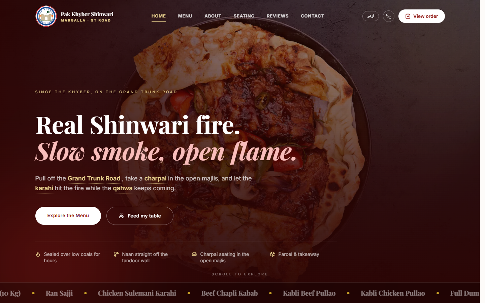

# Pak Khyber Shinwari

[](https://github.com/twinstack-studio/pak-khyber-shinwari/actions/workflows/ci.yml)
[](./LICENSE)
[](https://pks.twinstackstudio.com)

A bilingual website and online ordering system for Pak Khyber Shinwari, a
Shinwari restaurant on the GT Road at Margalla. Guests can browse the full menu
in English or Urdu, plan a meal for a group, and place a delivery or pickup
order. The restaurant's staff run orders, sold-out items, reviews and messages
from their own dashboard.

[**Open the live site**](https://pks.twinstackstudio.com) ·
[**Work with TwinStack Studio**](https://twinstackstudio.com/contact)



> **Note:** Card and mobile wallet payments are not connected yet, so every
> order is paid on delivery or pickup. Some dish photos are licensed stock
> images standing in until the restaurant's own photography is ready.

## What the product delivers

### For guests

- Full menu in English and Urdu, with right-to-left layout for Urdu and a language switch on every page
- Menu search, category navigation and live "sold out" labels set by the kitchen
- Cart and checkout for delivery or pickup, with the tax rate for the chosen payment method (5% card or wallet, 16% cash) shown before ordering
- Order tracking page for each order, found by a short reference such as `PKS-7QK2M`
- "Feed my table" planner that turns a number of guests into a suggested order and shows the portion rules it uses
- Seating floor plan, reviews, an About page and a contact form for events and general questions
- Animated hero, scroll effects and a signature dish showcase built for 360° photo spins, all respecting the visitor's reduced-motion setting

### For restaurant staff

- Staff sign-in with owner and manager roles. There is no public sign-up; accounts are created from the command line
- Live order board where staff move orders from placed through preparing and on the way to completed
- One-click availability switch to mark any dish sold out for the day
- Review moderation, so no review appears on the site until staff approve it
- Inbox for messages sent through the contact form

### Engineering highlights

- Prices are always calculated on the server from the menu. The browser sends only item ids and quantities, so a price cannot be changed from the browser
- Each order saves the dish name and price at the time of ordering, so past orders keep showing what the guest paid after the menu changes
- Amounts are stored as whole rupees to avoid rounding errors
- Every public form is validated with Zod, including Pakistani mobile number formats
- The menu lives in versioned JSON and only daily availability is stored in the database, which keeps the database small
- Pages that do not need the database still build and render when it is unavailable

## Technology

| Layer | Stack |
| --- | --- |
| Framework | Next.js 16 (App Router), React 19, TypeScript |
| Styling and motion | Tailwind CSS 4, Motion |
| Languages | next-intl (English and Urdu) |
| Data | PostgreSQL (Neon) with Prisma 7 |
| Authentication | Auth.js (NextAuth v5), bcrypt |
| Validation | Zod |
| Hosting | Vercel |

## Project structure

```text
pak-khyber-shinwari/
├── data/        Menu, photo credits, seating and About page content (JSON)
├── messages/    English and Urdu interface text
├── prisma/      Database schema and migrations
├── public/      Venue photos and video
├── scripts/     create-user.mjs for staff accounts
└── src/
    ├── app/
    │   ├── [locale]/   Public site: home, menu, checkout, order, seating, reviews, about, contact
    │   ├── admin/      Staff dashboard
    │   └── api/        Orders, reviews, enquiries and auth endpoints
    ├── components/     Interface, cart, checkout and motion components
    ├── i18n/           Locale routing
    └── lib/            Menu, pricing, orders, validation, auth and database
```

## Run locally

Requirements: Node.js 20+ and a PostgreSQL database. A free
[Neon](https://neon.tech) branch works.

```bash
git clone https://github.com/twinstack-studio/pak-khyber-shinwari.git
cd pak-khyber-shinwari

npm install
cp .env.example .env    # fill in DATABASE_URL and AUTH_SECRET
npm run db:migrate      # create the tables
npm run create-user -- you@example.com "Your Name" OWNER
npm run dev             # http://localhost:3000
```

`create-user` prints a generated password once. Staff sign in at
`http://localhost:3000/admin`. All configuration is documented in
[`.env.example`](./.env.example).

## Useful commands

| Command | What it does |
| --- | --- |
| `npm run dev` | Start the development server |
| `npm run lint` | Check the code with ESLint |
| `npm run build` | Apply database migrations and build for production |
| `npm start` | Serve the production build |
| `npm run db:migrate` | Create and apply a migration in development |
| `npm run db:studio` | Browse the database in Prisma Studio |
| `npm run create-user -- <email> <name> <OWNER\|MANAGER>` | Create or update a staff account |

## Built by TwinStack Studio

TwinStack Studio builds full-stack websites, web applications, dashboards,
portals, automation, and AI-powered products.

[GitHub](https://github.com/twinstack-studio) ·
[Website](https://twinstackstudio.com) ·
[Email](mailto:hello@twinstackstudio.com)

© 2026 TwinStack Studio. All rights reserved. See [LICENSE](./LICENSE).
